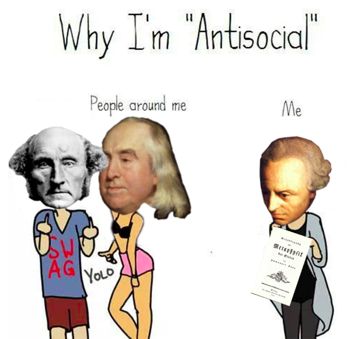

## The philosophy behind the hypotheticals
If you're already familiar with moral anti-realism & Kant's categorical imperative please skip ahead, one of my worst nightmares is mansplaining philosophy.

### The definition of morality
So I'm working with the definition that morality is what one ought to do to achieve some outcome deemed to be beneficial.

### Moral anti-realism
Moral anti-realism is the belief that objective morality does not exist, nothing is objectively good or objectively evil. Even things society regards as abhorrent such 
as mass murder, are not wrong or evil objectively in this framework. Moral anti-realism leaves room for relativist moral systems, but in our example we're going to ignore 
this possibility. I could write a long article about why having this belief is rational but I'll leave that for another time.

### Kant's categorical imperative
I'm aware there are multiple components to the categorical imperative, but for the sake of brevity lets leave it as this:

The categorical imperative is the idea that in order for an action to be ethical a society would still have to function if said action were to be commit by everyone.
For example by this standard skipping a vote is not ethical, as if no-one were to vote society would not function.

## Types of morality

### Emotional morality
The first type is emotional morality, some things simply feel wrong. There are obviously many reasons for this:
 
* Empathy: This is Schopenhauer's view that morality is entirely derived from empathy
* Societal conditioning: a society says that people being naked in public is immoral
* New is bad: the insular cortex is the section of the brain responsible for producing disgust reactions, if someone is not socialised around some
phenomena whilst they are young, their insular cortex can produce this reaction when they see something new. For instance a person is brought up in a 
totally heterosexual society, they see a gay couple and the reaction triggers. People conflate this reaction with a sense of moral justice. There are many 
mechanisms in the brain that can produce similar moral conclusions.

### Emotional Rational morality
First of all there is a type of emotional morality that masquerades as rationality morality, people have an emotional position, they do not realise it
and then they reverse engineer a argument. To be fair these arguments are generally on rational terms, but as they already have a conclusion, the 
argument cannot be seen as a rational argument. For example if I were to believe that Finland did not exist for religious reasons, and I produced an argument 
on rational terms:

* I have never met a finnish person
* Once I booked a flight to Finland and it was cancelled

These points may be anecdotal and weak but they are at least rational, I am not just saying "I don't feel like Finland exists". But the thing is, I am only saying
these things because I emotionally hold the opinion that Finland doesn't exist, so anything I use to rationalise that point is, in my mind, absolutely irrational.

### Rational morality
Now we're onto the good stuff, the philosophers descend down from from their dogma free mind-void and mathematically derive perfectly ethical behaviour. Of course I'm exaggerating
but there are systems out there are abstract enough that I believe they can be considered generally rational and not so emotional for example the aforementioned categorical 
imperative. These ideas will still contain a lot of bias, as every idea does, but as far as humans go I believe these tier of ideas are rational that one can use them against their 
emotional desires.

## The Hypothetical Societies
 
Let's create some societies. 

__Society A__
* No laws 
* Everyone is a moral anti-realist
* Everyone has high levels of empathy
* People are roughly as dumb & emotional as in our society (very dumb and emotional)

__Society ∀__
 * No laws
 * Everyone is a sociopath
 * Everyone is relatively emotionless
 * Everyone is smart
 * Everyone likes to murder
 * Everyone loves to live in a functioning society 
 * Everyone rationally holds the position of the categorical imperative
 * Everyone is aware of the prior facts

I believe that both societies will function perfectly fine in most circumstances, please listen to me ramble on as I explain why.
 
### Game Theory in Society ∀

Well I think we need to get into some game theory to figure out why I think society ∀ can work.

So in the [Prisoner's dilemma](https://en.wikipedia.org/wiki/Prisoner%27s_dilemma), even though we see both actions have the same 
[expected value](https://en.wikipedia.org/wiki/Expected_value) in terms of years in prison, people generally lean to the idea that it is better to try to betray your 
partner. There's actually a British gameshow based on this called _Golden Balls_ and it's just horrible to watch. Regardless you could cite 
the prisoner's dilemma and say: "If people have an inclination to betray, why would sociopaths, of all people not betray their compatriots in society ∀?".
This is exactly where the categorical imperative comes in, the sociopaths know that no one in the society has empathy & so I claim that people will
 not murder each other, despite their desire to and the lack of legal consequences. 
 
I believe these individuals will all come to 
the same conclusion, that in order to pursue their own interests they must behave in a quasi altrustic manner. 
Even if they were sure they could get  away with murder in private, if they follow the logic of the categorical imperative the society holds together.
They all know that everyone else in the society has these desires and they know everyone would be secretly 
murdering each other, and then the society would break down.

Okay so I know it's contrived but  in this scenario a society of murderous sociopaths has no murder at all, weird right. 

#### The Alternative, just for fun
Each individual sociopath upholds the imperative only because it is beneficial to themselves but in doing so they allow their entire society to function,
if they doubted that others would uphold the imperative they themselves would have no reason to uphold it either. 

This is the danger with this kind of pragmatic intellectual morals,
they are only upheld when they function. So if one does not believe others will uphold the morals, they will break them too. In this example this would lead to everyone murdering each other.
More specifically everyone gets murdered in the society except one person, the person who commits the final murder, I made a little program to simulate the phenomena.

### How does Society A function?
Society A would not function as a capitalist democracy, people do not feel sympathy for corporations and would relentlessly steal from them as there are not consequences. I speculate if we're to oversimplify 
the situation that society A could function as a barter economy. There would be a kind of natural equilibrium in this society, whenever someone noticably amasses too much wealth,
they either begin to give away their resources to the needy (as they feel guilty, they have high empathy). 
Or alternatively others begin to steal from said person, as they do not feel guilty from stealing from someone with excessive wealth. 

So why do I believe that society ∀ functions "better" than society A, what does better even mean. The criteria I'm using is how the societies 
adapt to hard times, almost any system can function to some extent when a society has an abundance of resources.

## How do the societies fair in hard times
So let's just say hypothetical, there's some form of influenza virus sweeping across the world driving industries to a halt. In this scenario each
society will have enough resources for every citizen but only as long as the citizen's do not take anymore resources than they need. Now the society ∀
moral system actually adapts to this perfectly, because they want their society to keep functioning I believe much like in the aforementioned example
that they will not take more resources than they need. 

However I believe that society A may begin to fall apart, because the issue of rationing is more in the intellectual realm and less the emotional,
people might not see how "just taking a little bit more" to be safe is negatively impacting others, and therefore would not feel guilty and hence 
individually may overstock. However those with inadequate resources to survive may reach out to others in order to try to get their share, this 
may work on some level but it is doubtful that everyone in the society will be exposed to this begging. 

Not Exposed to begging -> no guilt -> no sharing.

High empathy only effects individuals when they're aware of the suffering of others, ultimately what I'm trying to demonstrate is good old fashioned
empathy only create morality when all the actors both: have good information & are intelligent enough to understand the consequences of their actions.
Ignorance is bliss whilst you're ignorant of your ignorance. 

Ultimately I believe in both societies people are simply acting in their own interests, it just so happens that the driving criteria in society ∀, 
although contrived, produces better results for everyone. Sometimes in order to act in your own interests you must act in the interest of others.

## The guilt cycles of moral choices in complex systems
If I choose to buy a beef burger from McDonald's, this may seem inoffensive to almost everyone. But 
the problem is I'm not just paying the cashier for the burger, I'm interacting with many unseen actors: the McDonald's
it's supplier, the company that transports the ingredients, the company that grows the wheat for the bun, etc. By purchasing the burger, I'm providing an 
economic incentive to these actors to continue operating, without necessarily knowing a thing about their operations.
 
Once your brain starts to crunch the moral algebra you can start feeling guilty about actions which previously seemed completely acceptable. This is known as 
cognitive empathy.

Individually I still believe they fail to solve this problem. 

If I'm acting purely on the categorical imperative, I am aware that buying the burger will contribute to climate change and that when everyone 
follows this action it will make the world inhospitable for humans in the distant future. But ultimately I don't care, I won't be around then and
I will not forgo the pleasure of the burger as I will see no ill effects.

Morality based on empathy will simply not realise the consequences of buying the burger, as if we look at the immediate setting nothing is wrong
the employee's at the McDonald's make a living from serving you the burger, the McDonald's owner profits and you get your delicious burger. But 
if you crunch the moral algebra with _cognitive empathy_ and come out with the conclusion you can go down a spiral. 

"I should feel bad about buying this burger as it contributes a lot of carbon to the environment, I'll just have fries"

"The fries still contribute carbon to the environment, I'll just go home"

"I won't drive I'll just walk, less carbon. I guess I need a new car if I ever want to drive"

"I'll buy this toyota that saves the environment by instantly killing me"

This is a continuum fallacy, in order to escape this cycle of guilt there needs to be some means of estimating when enough is enough. The problem with cognitive empathy and a 
complex system like capitalism is it's basically impossible to work out when something is not right and hence when to feel guilt. This often leads to people either not feeling
guilty about any of their indirectly immoral actions, or feeling guilty about all of them.
This is where something like the categorical imperative comes in, maybe individually my actions are still contributing to climate change
but if everyone were to act in the same way, making the same magnitude of sacrifices things would be okay, or at least not so fucked as they
are now.

It's only in the combination of these in which the action can be reconsidered, I'm using the intellectual morality to invoke the empathetic response.
"I know this will negatively influence people in the future and I feel guilty about this/good for helping them". This combination is basically the 
core of my morality, using intellectual moral models to calculate the decision which invokes the best emotional response.

