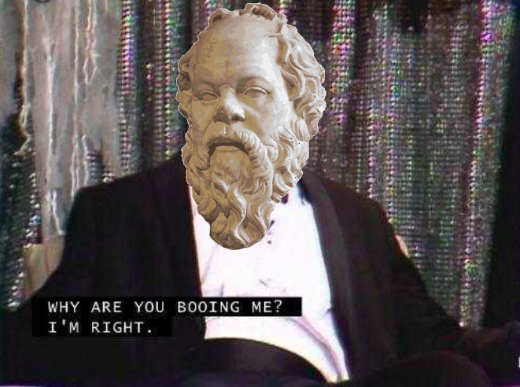
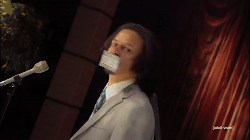

It's 2016 and everything is great: objective reality, free will, truth, good & evil all exist. Wow epic!
Things are simple & it's just great.

Then I fuck up my hands real bad and I can no longer program for hours on end. In order to feed my addiction to feeling like I'm progressing, I force myself to read to some books. 
I eventually get around to reading nonfiction and as usual, the philosophers came in with their fancy 
ideas and ruined my state of existential peace (__BOO!__)

So what now? Determined to find some answers I read some more books, this did not help the situation. Not learning my lesson I kept reading 
and eventually I found Nietzche, who can be a real piece of shit sometimes but is also v. smart & based and I kinda like love him okay?

In his bible 'Thus Spoke Zarathustra' he introduces this concept of the camel, the lion and the child.
Very briefly: You're born and as you grow up society puts this ideological baggage onto you (clean your teeth, don't wear odd socks, try not to murder anyone, blah blah blah),
you become a camel holding onto all of these beliefs over the big metaphorical humps on your big metaphorical back. 
Then you might realise this has happened and try to fight back, throwing all these baggage away you become the lion. If you're successful you clear yourself of your dogma (fat chance) and become
the child. This idea really resonated with me at the time as I think I was going through for the first time *1.

Being free of baggage is pretty cool but it's also very vacuous, the framework(s) you used to understand the big picture are gone and you're face to face 
with the overwhelming chaos of reality. So Nietzsche suggests you find your own meaning. I followed that suggestion, so what mattered to me?
 
I traced the root of all my desires if traced back far enough, lead to a belief of that action
making me happy. Desire for Money -> Derived from desire for Power -> Derived from desire for Respect -> Derived from desire for Happiness.
So in a world where nothing matters, I could at the very least empirically verify that happiness, in it's most
abstract form was desirable. There's also the opposite of happiness, which should be avoided as I could empirically verify, it was bad :(

But Aristotle talks of there being two opposites, not only  happiness to sadness (negation) but also happiness to non-happiness (absence) someone who
is not happy is not necessarily sad. So we know I like happiness & dislike sadness, very controversial.

But this isn't meaning, why should I live? What is meaningful about happiness?

## Utility Calculus

Okay let's get some definitions of abstract happiness & sadness, I find this easy if we define this in terms of days as moments are too fleeting to be useful here *2.

__A Happy day__: A day in which on average I actively preferred living

__A Sad day__: A day in which on average I actively preferred not living

__A Neutral day__: A theoretical day so perfectly balanced in terms of _good_ and _bad_ events/sequences, that I have absolutely no preference as to whether I was alive or not on said day.

Why does this matter? Because if I am actively enjoying being alive for that period, life itself is worth living. My meaning in life can be to maximise my personal remaining net happiness, 
maximising my desire to continue living. My reason to live is assuming I am living "happy days" on average, living is in itself worthwhile to me. My reason to live is to live.

 Now things are about to get _controversial_ so buckle your seat belts.

## Let's get quantifying

Okay so let's say the best hypothetical day ever, in which I'm at disney land with Nietzche and he freudian slips calling me son. This hypothetical best day, would score a 1.0.
The inverse the worst possible day, a -1.0. And the hypothetical perfectly neutral day a 0.0. 

__My personal net utility value__: The mean of every value of my life

If we think in these terms, the meaning of my life is maximise my personal net utility value. 

## The hypothetical

I can never know my personal utility value, without running into something like Laplace's demon. This is an omniscient demon that knows everything about the current state of the universe, so in determinist theory, knows the future. 
So if I were to meet Laplace's demon at, let's say, the pub. I were to ask it: 
"What is the remaining net utility value of my life?"

If the demon were to say anything below 0, even minutely smaller, I believe that the rational action is to end my own life.

Because on average, tautologically, the life is not worth living.

This is what people usually object to, they say "well sometimes you have to have the bad times to know what the good times are", which is very true but this is accounted for in the calculation. 
The value includes every possible consideration, this is an all-knowing demon that is telling me the remainder of my life, is by my definition not worth living.

If someone is a little bit more attentive they might say "well then you should end your life when it gets bad, when you no longer anticipate that the future will be enjoyable you can end it then. 
Maybe you have a great next 20 years and then a terrible 40 after that, the demon says your life is overall bad but you can still live out those 20 years of happiness."

This is pretty smart but this is an all-knowing demon. It knows when you're going to end it, you can't outsmart it by tactically only living the good years. 
The demon knew that you would ask it that question, it knows how you hearing that answer will effect the rest of your life. 

The unfortunate consequence of remaining rationally consistent here is to end your life asap. The other unfortunate consequence is: if you didn't go to the pub and ask the demon the question, you might have
lived a great life with a whopping personal utility value.
 
In conclusion, ignorance is bliss both in terms of demons at the pub and in philosophy, stay out of school kids.

#### Footnotes
*1 I believe this is more of a cyclical process and this was my very first baby cycle

*2 Many philosopher's such as Bergson & Saint Augustine have put forward the argument that a moment is infinitely divisible and as such is infinitely small, maybe I'm focusing
too much on semantics but this doesn't demonstrate my point as well.